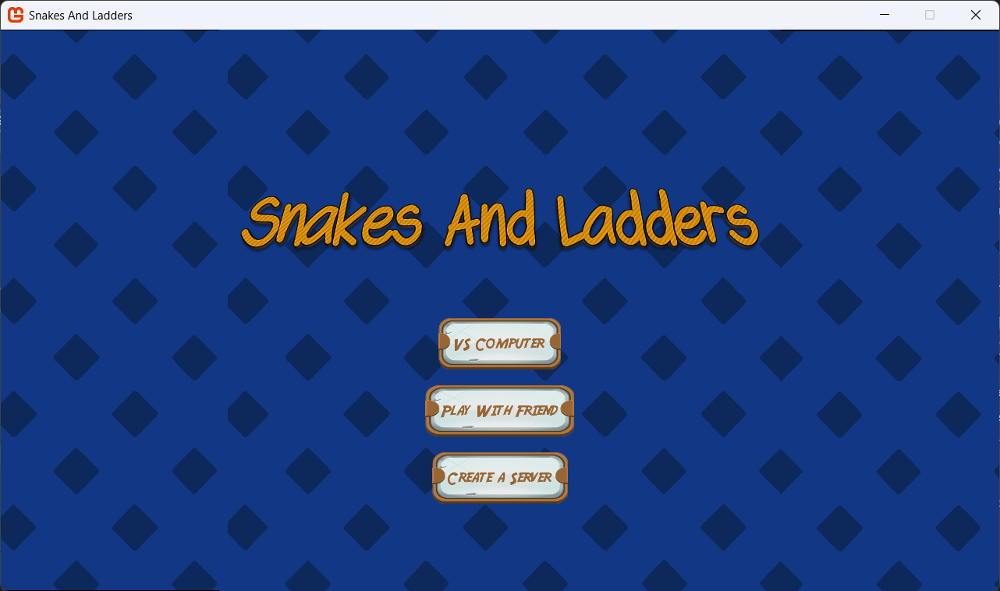
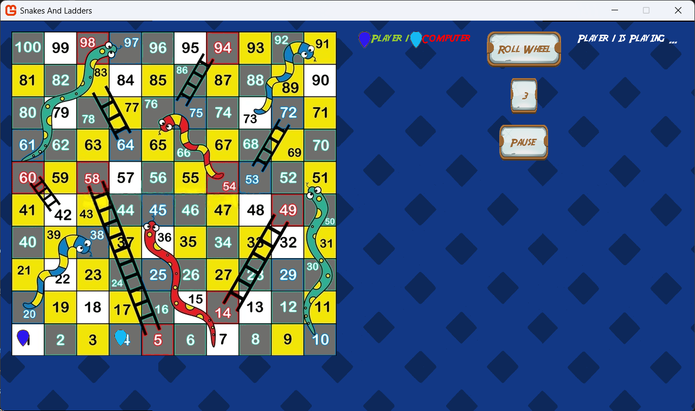

# Snakes And Ladder

## Current Features
- Implemented a tiny UI framework from scratch:
	- used an event manager and an event queue to handle events and process events dynimcally
	- implemented the following UI components:
		- Button
		- Label
		- Input Text (can be customized to accept specific types of inputs)
		- Image
	- implemented layout containers that lays out the internal components in a certain way depending on the type of the container used
	- implemented a flexaible screen navigator that is built with the help of a stack so that you can push screens from anywhere in the app and keeps the history of the visited screens and allows overwriting existing ones
	- implemented a dialog box that is at the end of the day acts as a screen that does not take the full width and height
	- added the ability to override draw methods in any screen to give the ability to create something like a board game or draw custom images on top of built-in UI elements
- Added Enhancements to UI to make look better
- Added Networking Capability
	- you can now play with your friend on LAN
		- one of the players creates a server and waits until the other joins
		- once the other one joins the server player can start game
		- once the game starts for now the server player will always play first
		- afterwards the play will be transferred to the other player
		- the turn goes back to the other player and so on and so forth...

## Some Screenshots From The Game:

